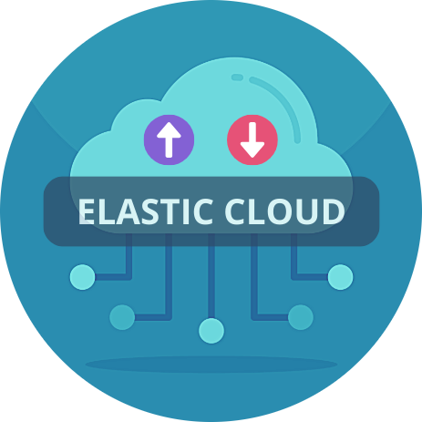

# ElasticStack

If **ElasticStack** helps you, consider giving us a ⭐ on GitHub! Your support encourages future development and helps others discover this tool!



**ElasticStack** is a multi-cloud auto-scaling function deployment tool that supports AWS, Azure, and GCP. This project automates the deployment of auto-scaling cloud functions based on specific metrics such as network traffic, CPU, or memory usage. It utilizes Terraform for infrastructure setup and cloud-native function services for scaling.

## 🚀 Features

### 🏗️ Multi-cloud Support
- AWS: Deploy Lambda functions and scale EC2 instances automatically.
- Azure: Deploy Azure Functions with auto-scaling based on resource metrics.
- GCP: Deploy Google Cloud Functions with dynamic scaling based on your requirements.

### ⚙️ Auto-Scaling Configuration
- Set up auto-scaling to trigger based on custom metrics like CPU utilization or network traffic.
- Automatically adjusts cloud compute resources based on your workload.

### 🔧 Terraform Integration
- Automate cloud resource deployment using Terraform, ensuring consistency across environments.
- Infrastructure as code for easy management and scaling.

### 📈 Real-Time Monitoring
- Track scaling decisions and function execution logs through cloud-native logging services (CloudWatch, Azure Monitor, GCP Stackdriver).

---

## 🛠️ Installation & Setup

### 1. Clone the Repository

Start by cloning the repository to your local machine:

```
git clone https://github.com/ArpitStack/elastic-stack.git
cd elastic-stack
```

### 2. Prerequisites

Make sure you have the following tools installed:
- **Terraform**: Used for infrastructure setup.
- **AWS CLI**: For deploying Lambda functions to AWS.
- **Azure CLI**: For deploying Azure Functions.
- **Google Cloud SDK**: For deploying GCP Cloud Functions.

### 3. Set Up Your Cloud Credentials

#### AWS:
1. Install AWS CLI and configure it using the command:

```
aws configure
```

2. Provide your **AWS Access Key**, **Secret Key**, and **Default Region**.

#### Azure:
1. Install Azure CLI and sign in with:

```
az login
```

#### GCP:
1. Install Google Cloud SDK and authenticate with:

```
gcloud auth login
```

---

## 🔧 Using the Project

### 1. **Function Code Setup**

The project is structured into different cloud provider folders:

- `cloud/aws/` – Contains AWS Lambda function code and Terraform configuration.
- `cloud/azure/` – Contains Azure Function code and Terraform configuration.
- `cloud/gcp/` – Contains GCP Cloud Function code and Terraform configuration.

### 2. **Cloud Deployment**

Each cloud provider has a deployment script that will package the respective function code, deploy it to the cloud, and configure the necessary infrastructure using Terraform. Follow the instructions for your desired cloud provider.

#### AWS:

To deploy AWS infrastructure and Lambda function:

1. **Set environment variables:**
You will need to provide your AWS EC2 instance ID and AWS region:

```
export AWS_REGION="your-aws-region" export AWS_INSTANCE_ID="your-ec2-instance-id"
```

2. **Run the deployment script:**
The script will package the Lambda function code, deploy the infrastructure using Terraform, and configure AWS resources.

```
bash deploy_toaws.sh <instance-id> <aws-region>
```


3. **Verify Deployment:**
After running the script, Check the AWS Lambda console to verify the function is deployed correctly. You can also check the CloudWatch logs to monitor the scaling events.

#### Azure:

To deploy Azure infrastructure and Azure Function:

1. **Set environment variables:**
You will need to provide your Azure location, subscription ID, and resource group name:

```
export AZURE_LOCATION="your-azure-location"
export AZURE_SUBSCRIPTION_ID="your-azure-subscription-id"
export AZURE_RESOURCE_GROUP="your-azure-resource-group"
```

2. **Run the deployment script:**
The script will package the Azure function code and apply the Terraform configuration to set up Azure resources.

```
bash deploy_toazure.sh
```

3. **Verify Deployment:**
After running the script, check the Azure portal to verify that your function and resources are properly deployed. You can monitor logs in the Azure portal to track scaling actions.

#### GCP:

To deploy GCP infrastructure and Cloud Function:

1. **Set environment variables:**
You will need to provide your GCP project ID, zone, and instance name:

```
export GCP_PROJECT_ID="your-gcp-project-id"
export GCP_ZONE="your-gcp-zone"
export GCP_INSTANCE_NAME="your-gcp-instance-name"
```

2. **Run the deployment script:**
This script will package the GCP Cloud Function code, deploy the infrastructure, and configure GCP resources.

```
bash deploy_togcp.sh
```


3. **Verify Deployment:**
After running the script, check the GCP Cloud Functions console to confirm that the function is deployed successfully. You can also check GCP Stackdriver (Cloud Logging) to verify the function's execution and scaling actions.

---

### 3. **Cloud Function Execution**

After deploying the function to the respective cloud provider, the function will automatically scale compute instances based on predefined network traffic metrics (or other metrics that you customize).

1. **Triggering the Function Manually:**
You can manually invoke the function via the respective cloud provider's console or CLI to test the scaling functionality.

For example, for AWS:

```
aws lambda invoke --function-name <lambda-function-name> output.txt
```

For Azure:

```
az functionapp function invoke --name <function-name> --resource-group <resource-group> --function-name <function-name>
```

For GCP:
```
gcloud functions call <function-name>
```


2. **Monitoring Function Execution:**
- Check the respective cloud console (AWS CloudWatch, Azure Monitor, or GCP Cloud Logging) for logs on the scaling decisions.
- Look for logs that indicate whether the function scaled the compute instance up or down based on the metrics.

---

### 4. **Function Customization**

You can customize the function code to scale based on different metrics, such as CPU usage, memory usage, or traffic volume. Modify the logic in the following files to adjust scaling criteria and thresholds:

- **AWS:** `cloud/aws/lambda_function.py`
- **Azure:** `cloud/azure/azure_function.py`
- **GCP:** `cloud/gcp/cloud_function.py`

For example, you can change the metric thresholds in these files to trigger scaling actions at different values, depending on your resource requirements.

---

## ⚙️ **Configuration Options**

If you need to configure specific settings or thresholds for scaling, modify the code and settings within each cloud provider’s respective function code:

- **Scaling thresholds:** Adjust the logic in the function code to specify when to scale up or down.
- **Custom metrics:** Change the metric that the function uses to make scaling decisions (e.g., switch from network traffic to CPU utilization).

---

## 🔄 **Testing the Auto-Scaling Function**

Once the infrastructure is deployed and functions are set up, you can test the auto-scaling functionality by:

1. Generating traffic on the resources to trigger scaling actions.
2. Manually invoking the function to simulate scaling events.
3. Monitoring cloud logs to verify scaling actions.

If everything is set up correctly, your compute resources should scale automatically based on the defined thresholds.

---

## 📄 License

This project is licensed under the Apache License, Version 2.0 - see the LICENSE file for details.

## 🤝 Contributing

We welcome contributions! If you would like to contribute to **ElasticStack**, please follow these steps:

### 1. Fork the Repository
Click the "Fork" button at the top-right of the repository page on GitHub.

### 2. Clone Your Fork
Clone your forked repository to your local machine:

git clone https://github.com/<YourUsername>/elasticstack.git cd elastic-stack

